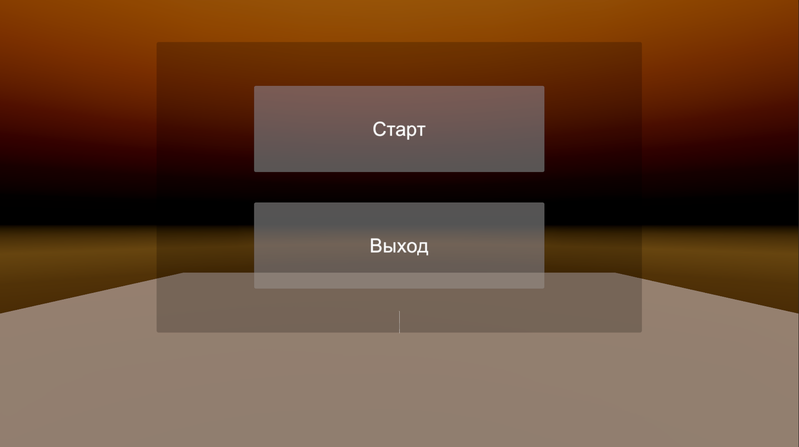
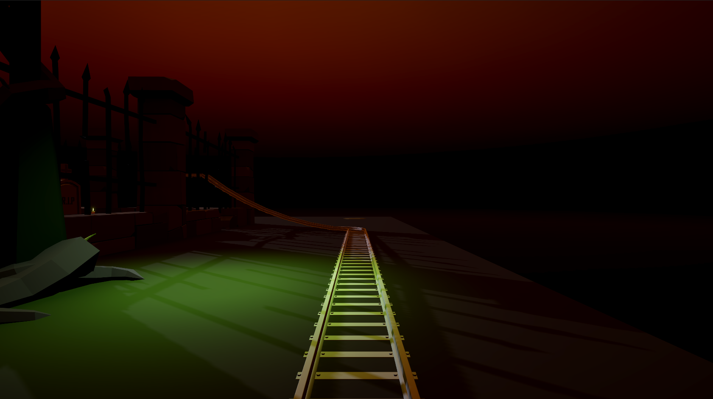
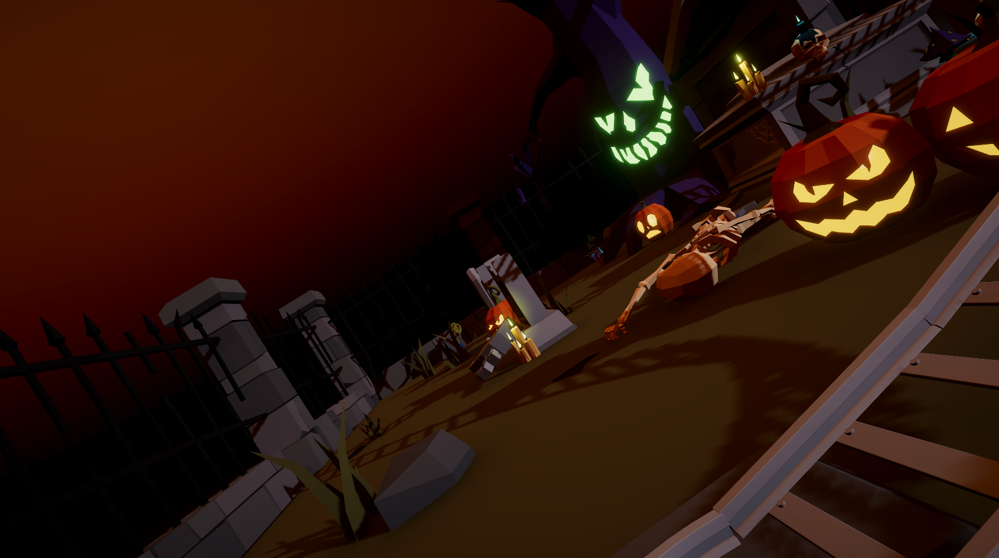
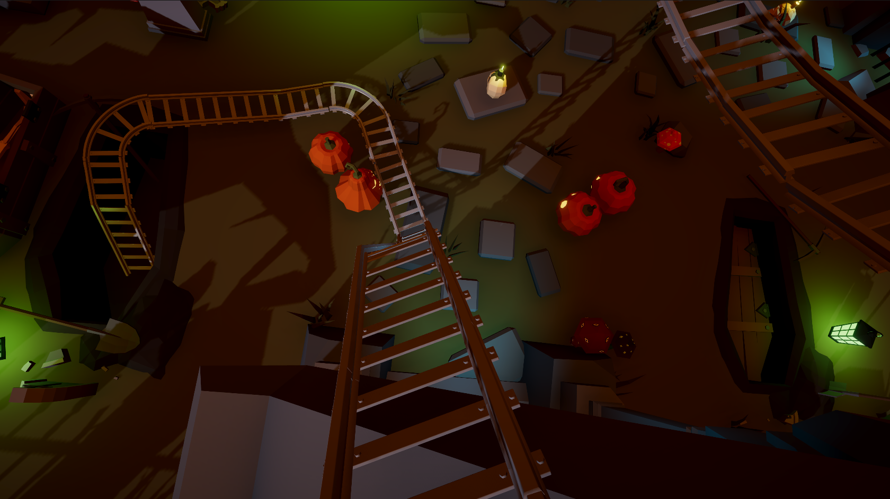
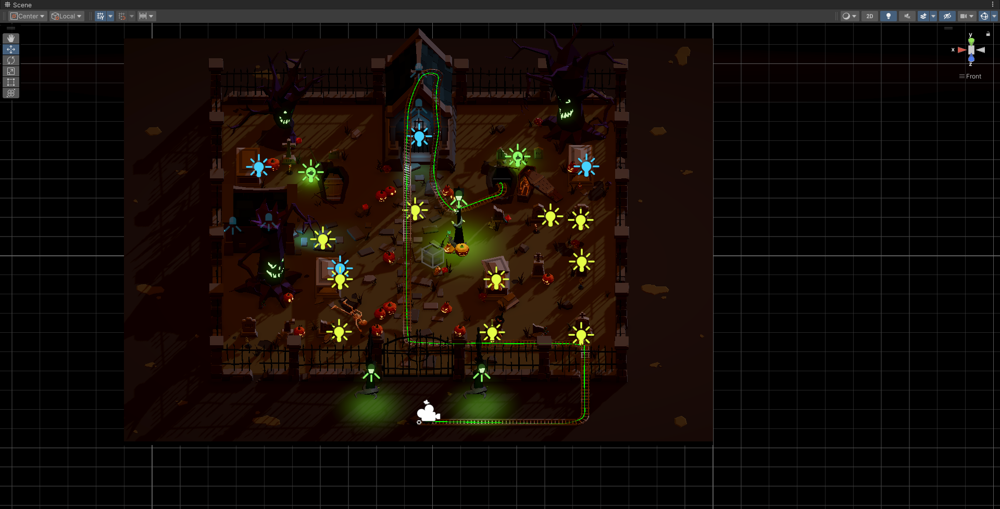

# Graveyard Roller Coaster

Eng | [Rus](resources/localization_readme/README_RU.md)

## Description

Educational project for creating a game in Unity. The game is a short cinematic experience where the player is just an observer sitting in a minecart and rolling through a graveyard roller coaster.

The game consists of several scenes, including the main menu and the actual gameplay.

## License

``` text
MIT License
```

## Screenshots

### Main Menu



### Gameplay





### Maps


